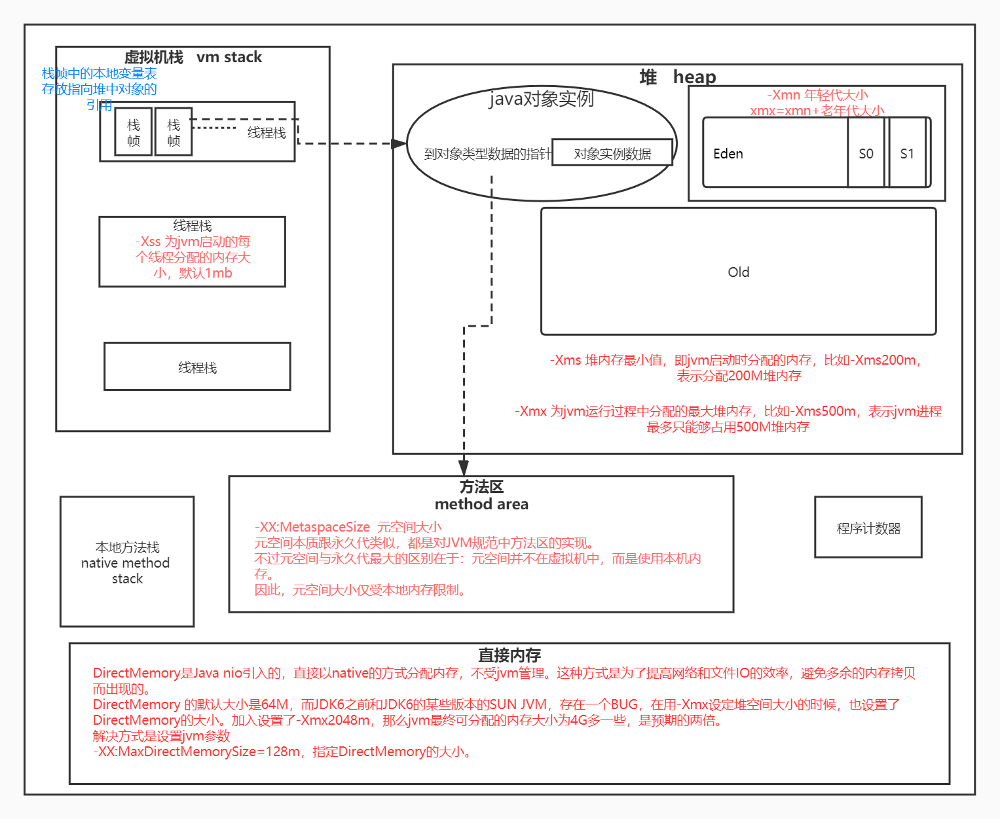

#训练营第01周课程作业
##Week01 作业题目（周四）：
###1.（选做）自己写一个简单的 Hello.java，里面需要涉及基本类型，四则运行，if 和 for，然后自己分析一下对应的字节码，有问题群里讨论。

###2.（必做）自定义一个 Classloader，加载一个 Hello.xlass 文件，执行 hello 方法，此文件内容是一个 Hello.class 文件所有字节（x=255-x）处理后的文件。文件群里提供。
[代码文件](code/HelloClassLoader.java "")
###3.（必做）画一张图，展示 Xmx、Xms、Xmn、Meta、DirectMemory、Xss 这些内存参数的关系。

###4.（选做）检查一下自己维护的业务系统的 JVM 参数配置，用 jstat 和 jstack、jmap 查看一下详情，并且自己独立分析一下大概情况，思考有没有不合理的地方，如何改进。
    注意：对于线上有流量的系统，慎重使用 jmap 命令。
    如果没有线上系统，可以自己 run 一个 web/java 项目。或者直接查看 idea 进程。
##Week01 作业题目（周六）：
###1.（选做）本机使用 G1 GC 启动一个程序，仿照课上案例分析一下 JVM 情况。可以使用 gateway-server-0.0.1-SNAPSHOT.jar 
    注意关闭自适应参数:-XX:-UseAdaptiveSizePolicy
    java -Xmx1g -Xms1g -XX:-UseAdaptiveSizePolicy -XX:+UseSerialGC -jar target/gateway-server- 0.0.1-SNAPSHOT.jar
    java -Xmx1g -Xms1g -XX:-UseAdaptiveSizePolicy -XX:+UseParallelGC -jar target/gateway-server- 0.0.1-SNAPSHOT.jar
    java -Xmx1g -Xms1g -XX:-UseAdaptiveSizePolicy -XX:+UseConcMarkSweepGC -jar target/gateway-server-0.0.1-SNAPSHOT.jar
    java -Xmx1g -Xms1g -XX:-UseAdaptiveSizePolicy -XX:+UseG1GC -XX:MaxGCPauseMillis=50 -jar target/gateway-server-0.0.1-SNAPSHOT.jar
    使用 jmap，jstat，jstack，以及可视化工具，查看 jvm 情况。 mac 上可以用 wrk，windows 上可以按照 superbenchmark 压测 http://localhost:8088/api/hello 查看 jvm。