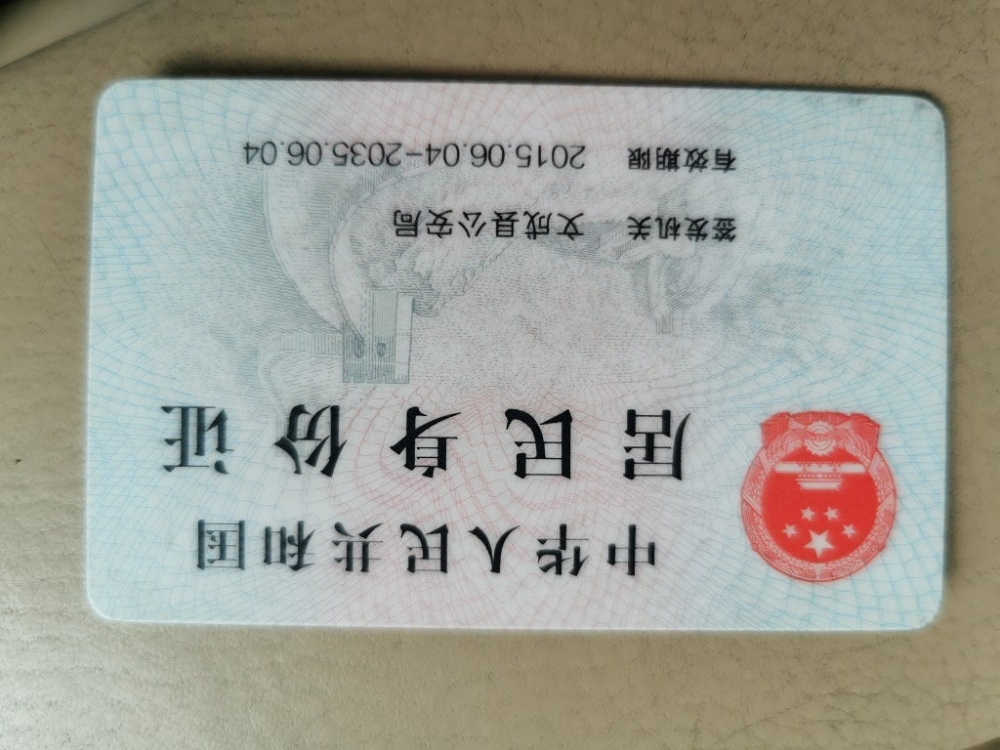

标题

# 这是一级标题
## 这是二级标题
### 这是三级标题
#### 这是四级标题
##### 这是五级标题
###### 这是六级标题

字体

**这是加粗的文字**
*这是倾斜的文字*`
***这是斜体加粗的文字***
~~这是加删除线的文字~~

引用

>这是引用的内容
>>这是引用的内容
>>>>>>>>>>这是引用的内容

分割线

---
----
***
*****

图片



超链接

[超链接名](photo.jpg "超链接title")

列表

- 列表内容
   1. 列表内容
   2. 列表内容
   3. 列表内容
+ 列表内容
* 列表内容

代码

`代码内容`
```
  代码...
  代码...
  代码...
```

表格

|  表头   | 表头  |
|  ----  | ----  |
| 单元格  | 单元格 |
| 单元格  | 单元格 |